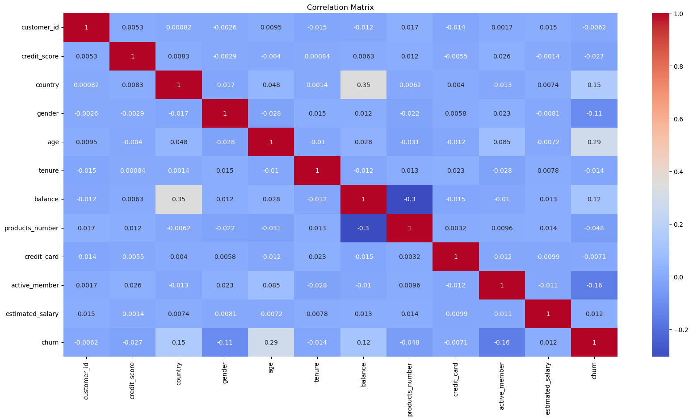
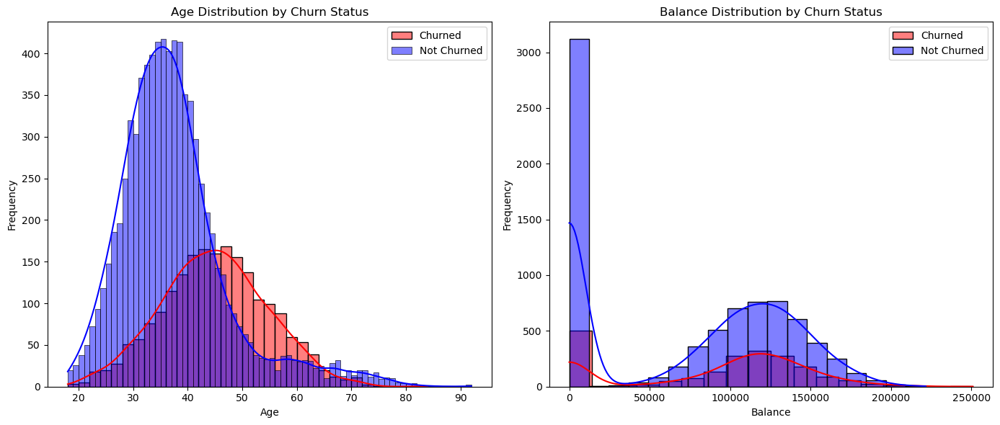
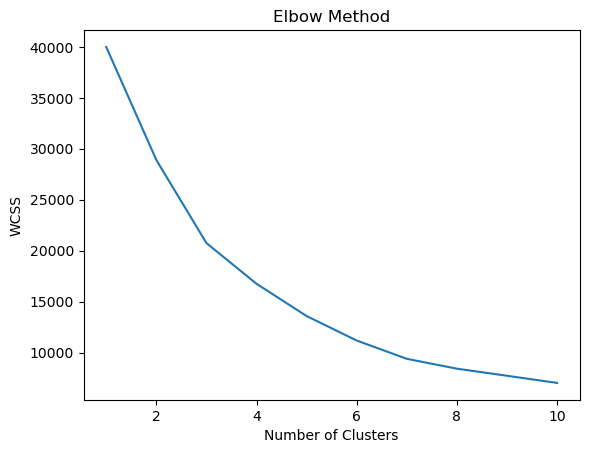
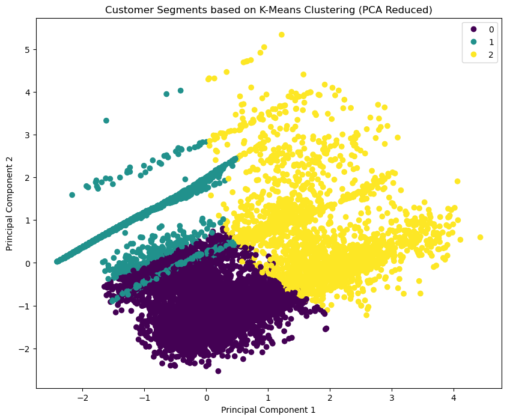

# Bank Customer Churn Prediction

This project is aimed at predicting customer churn and segmenting customers based on their likelihood of churn. The goal is to identify at-risk customers and recommend strategies to improve retention. The analysis is based on a dataset that includes various customer attributes such as age, balance, product usage, and account activity.

## Table of Contents
1. [Project Overview](#project-overview)
2. [Data Overview](#data-overview)
3. [Exploratory Data Analysis (EDA)](#exploratory-data-analysis-eda)
4. [Modeling Approach](#modeling-approach)
5. [Model Performance](#model-performance)
6. [Customer Segmentation](#customer-segmentation)
7. [Key Insights and Recommendations](#key-insights-and-recommendations)
8. [Implementation Plan](#implementation-plan)
9. [Conclusion](#conclusion)
10. [Future Work](#future-work)

## Project Overview
The objective of this project is to develop a predictive model to identify customers likely to churn and to segment the customer base based on their churn likelihood. This will allow the company to implement targeted retention strategies and reduce customer churn.

## Data Overview

The dataset includes the following key features:
- Age
- Balance
- Number of Products
- Account Activity
- Churn Probability (Model Output)
##  Data Preparation
The following steps were taken to prepare the data for analysis:
- **Handling Missing Values:** Missing values were imputed.
- **Feature Engineering:** New features were created, including churn probability.
- **Scaling:** Numeric features were scaled to improve model performance.

## Exploratory Data Analysis (EDA)
Exploratory data analysis was conducted to uncover key insights from the data, including:
- **Age Distribution**
- **Balance Distribution**
- **Churn Rate:** Percentage of customers who churned.

Visualizations such as histograms and correlation matrices were used to understand the relationships between features.
### Correlation Matrix

### Age and Balance Distribution by Churn Status

## Modeling Approach
The model chosen for predicting customer churn was **XGBoost** due to its robustness in handling imbalanced data. The model was fine-tuned using GridSearchCV and validated with 5-fold cross-validation.

## Model Performance
The performance of the model was evaluated using the following metrics:
- **Accuracy:** 0.864
- **Precision:** 0.85
- **Recall**:0.86
- **F1-Score:** 0.85
A confusion matrix was also generated to analyze the true positives, true negatives, false positives, and false negatives.

## Customer Segmentation
Customers were segmented using **K-Means Clustering** into three clusters:
- **Cluster 0:** Younger, high-balance customers with low churn probability.
- **Cluster 1:** Customers with lower balances but low churn probability.
- **Cluster 2:** Older, moderate-balance customers with higher churn probability.
### Elbow Method for Optimal Clusters

### PCA Visualization of Customer Segments

## Key Insights and Recommendations

- **Cluster 0 (Low Risk):** Focus on loyalty programs and upselling strategies.
- **Cluster 1 (Moderate Risk):** Maintain customer satisfaction and engagement.
- **Cluster 2 (High Risk):** Implement retention and re-engagement strategies.

## Implementation Plan
### Short-Term Actions
- Launch targeted retention campaigns.
- Collect feedback from high-risk customers.

### Long-Term Actions
- Integrate the churn prediction model into the CRM system for real-time monitoring.
- Continuously update the model with new data and refine segmentation strategies.

## Conclusion

The analysis provided valuable insights into customer behavior and churn risks, enabling the company to develop targeted strategies to improve retention and customer satisfaction.

## Future Work

- **Further Segmentation:** Explore additional features for more granular segmentation.
- **Model Enhancements:** Incorporate more advanced machine learning techniques to improve prediction accuracy.

## License

This project is licensed under the MIT License - see the [LICENSE](LICENSE) file for details.

## Contact
If you have any questions or want to discuss the project, feel free to reach out:
- **Name**: Shalabh Singh Yadav
- **Email**: [shalabhsinghyadav@gmail.com](mailto:shalabhsinghyadav@gmail.com)
- **LinkedIn**: [LinkedIn Profile](https://www.linkedin.com/in/shalabh-singh-yadav-66b607204/)
- **Tableau**: [Tableau Profile](https://public.tableau.com/app/profile/shalabh.yadav/vizzes)